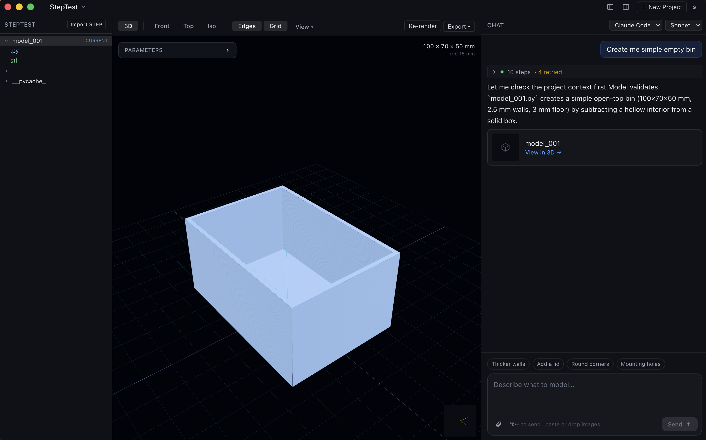

# VibeCAD

Local-first, agent-native desktop app for 3D parametric CAD. Wraps AI coding agents (Claude Code, OpenCode, Codex) over OpenSCAD or build123d modeling backends.



## Requirements

- Node.js 22+
- One or more agent CLIs on `PATH`: `claude` (Claude Code), `opencode`, or `codex`
- **OpenSCAD backend**: `openscad` on `PATH`
- **build123d backend**: `python3` + `build123d` + `f3d` on `PATH`

## Setup

```bash
npm run setup
npm run dev:desktop
```

## How it works

Two orthogonal axes:

| Axis     | Options                                                         |
| -------- | --------------------------------------------------------------- |
| Agent    | Claude Code · OpenCode · Codex                                  |
| Modeling | OpenSCAD (.scad → STL/3MF) · build123d (.py → STL/3MF/STEP/DXF) |

You describe what to model in chat. The agent writes/edits the model file using a backend-specific skill. The app watches the project directory and updates the 3D preview automatically.

## Commands

```bash
npm run dev:desktop   # start full app (renderer + electron)
npm run dev:renderer  # renderer only
npm run build         # production build (.dmg / .exe / .AppImage)
npm run typecheck     # tsc check across all workspaces
npm run test          # vitest
npm run db:generate   # generate Drizzle migrations
npm run db:studio     # Drizzle Studio UI
```

## Stack

- Electron 41 · React 19 · Zustand · Vite 7 · Tailwind v4
- better-sqlite3 + Drizzle ORM (SQLite, WAL mode)
- tsup (main/preload) · Zod 4 (validation)

## License

MIT
